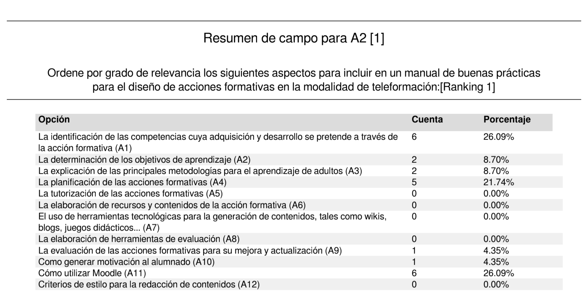
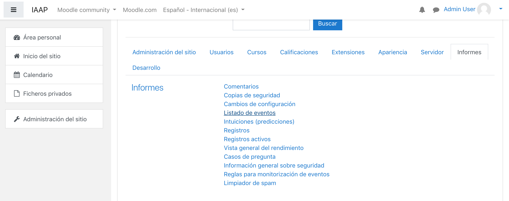
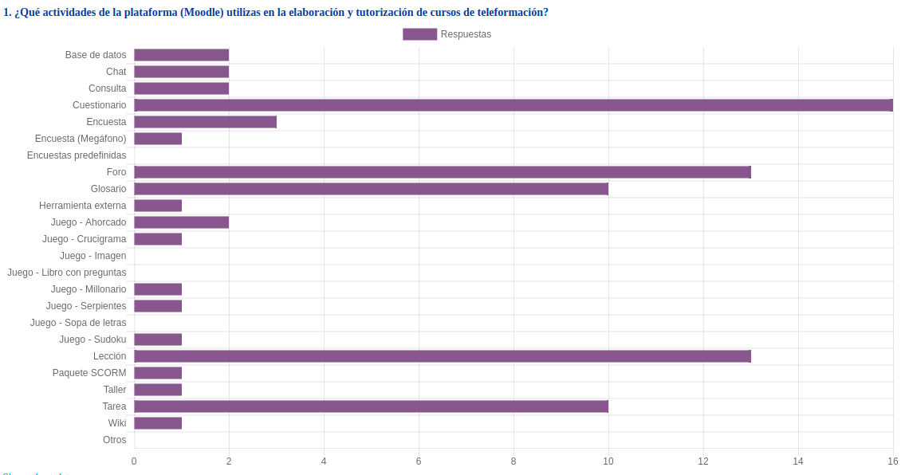
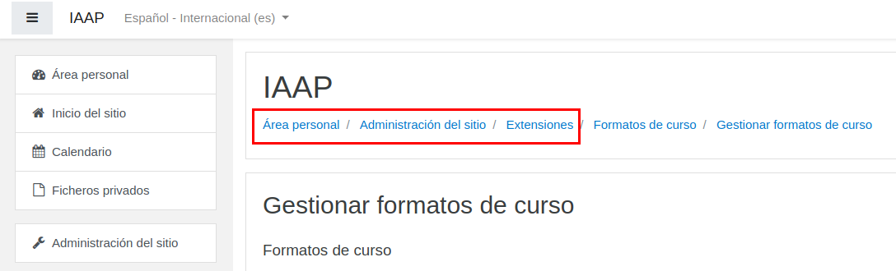
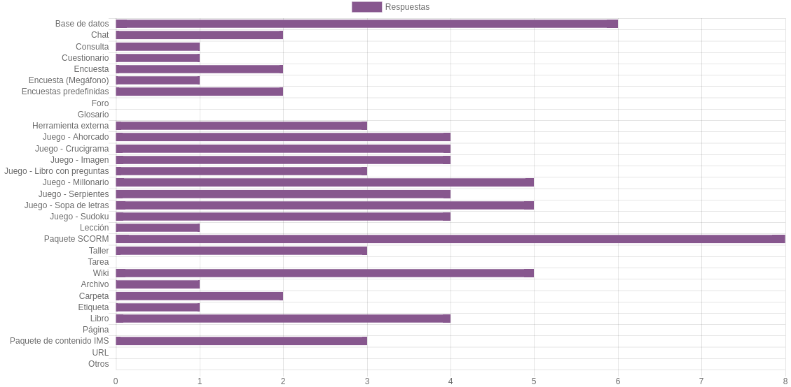

# Segunda sesión

### From MIT to LIT - Creando contendios

---

### Resultados de la encuesta

---

## De lo concreto a lo abstracto
### Partamos de un ejemplo ¿Sobre qué queremos ofrecer una formación?

---

## Metodologías del aprendizaje

[Learn by doing](https://blogthinkbig.com/learning-by-doing):
* Tiene lugar fuera de la escuela
* Es impulsado por metas que se fija el alumno
* Es a la vez proyectado por los propios intereses del alumno
* Depende fuertemente de los errores, dado que si algo funciona bien la primera vez no es interesante, no invita a perfeccionar y a mejorar
* _Es  divertido_

----

### Lo contrario de aprender haciendo:

* Es un aprendizaje involuntario, el alumno no lo elige
* Las metas son de la escuela, no del alumno
* La enseñanza es uniforme e ignora los intereses del alumno
* En la educación reglada el error es algo mal visto, algo evitable y no un acicate para mejorar
* El sistema tradicional no es divertido, no es capaz de motivar al alumnado

----

#### Lo que Roger Schank considera aprendizaje:

* Tienes una meta
* Tienes una expectativa que un plan de acción, construido sobre casos precedentes, conseguirá alcanzar
* El plan falla
* Necesitas una explicación del fallo (aquí es donde entra el profesor o la propia reflexión del alumno)
* Modificas una explicación antigua o alguien te suministra una nueva
* Generas una nueva expectativa y lo intentas de nuevo

----

Finalmente, Roger Schank introduce el concepto de “educación bajo demanda”:

> Sin lecturas. Sin exámenes. Solamente habilidades del mundo real. Aprender haciendo. Cursos cortos online que enseñen habilidades del mundo real en un entorno basado en aprender haciendo.

----

>A los estudiantes se les plantea desafíos, situaciones del mundo real que resuelven en pequeños grupos y que tienen como producto los mismos entregables que producirían si fuesen profesionales en activo en un empleo.

---

### Según tú [¿cómo debería se una aprendizaje on-line efectivo?](https://pollev.com/jesuslopez957)

<iframe src="https://embed.polleverywhere.com/free_text_polls/bacg3FOmzoOzY3d?controls=none&short_poll=true" width="100%" height="100%" frameBorder="0"></iframe>

---

## Hagamos grupos

Revisad vuestro mail en 5 min

---

## Determinamos los objetivos de aprendizaje

---

## Cómo generar motivación en el  alumnado

---

# Uso de herramientas para la generación de contenidos

----

### El libro de Moodle

<iframe src="https://catedu.gitbooks.io/moodle-para-la-ensenanza/content/libro.html" frameborder="0" width="100%" height="700" allowfullscreen="true" mozallowfullscreen="true" webkitallowfullscreen="true"></iframe>

----

### La wiki en Moodle

<iframe width="560" height="315" src="https://www.youtube.com/embed/psqdEiHh9gY" frameborder="0" allow="accelerometer; autoplay; encrypted-media; gyroscope; picture-in-picture" allowfullscreen></iframe>

----

### Plataformas gamificadas

* [Edpuzzle](https://edpuzzle.com/)
* [Kahoot](https://kahoot.com/)
* [Socrative](https://www.socrative.com/)
* [Quizziz](https://quizizz.com/    )

----

### La radio

<iframe src="https://catedu.gitbooks.io/la-radio-en-la-escuela/content/" frameborder="0" width="100%" height="700" allowfullscreen="true" mozallowfullscreen="true" webkitallowfullscreen="true"></iframe>

----

### Video tutoriales

<iframe src="https://catedu.gitbooks.io/edicion-de-video-tutoriales/content/" frameborder="0" width="100%" height="700" allowfullscreen="true" mozallowfullscreen="true" webkitallowfullscreen="true"></iframe>

---

### Criterios de estilo para la redacción de contenidos. [Rellenamos el punto 5.4 Estilo](https://docs.google.com/document/d/1Ausx2aXwxWFC0neVehYHsRX2Ns272qfNMDR4qd-GZ5w/edit#heading=h.5y5tut6q9dtl)

Un breve ejemplo:

<iframe src="https://catedu.gitbooks.io/manual-de-creadores/content/index0.html" frameborder="0" width="100%" height="700" allowfullscreen="true" mozallowfullscreen="true" webkitallowfullscreen="true"></iframe>

---

### La elaboración de recursos y contenidos de la acción formativa. [Elaboramos el resto del punto 5](https://docs.google.com/document/d/1Ausx2aXwxWFC0neVehYHsRX2Ns272qfNMDR4qd-GZ5w/edit#heading=h.q42y7ofx3cy7)

---

## ¿Cómo va quedando?

----

<iframe src="https://docs.google.com/document/d/1MXCGvnqsSq0FWxLk1OAHBb7Qa6UC9wq8z-7-m_4pSoI/edit" frameborder="0" width="100%" height="700" allowfullscreen="true" mozallowfullscreen="true" webkitallowfullscreen="true"></iframe>

----

<iframe src="https://docs.google.com/document/d/1gi7ErIjjaA04pmJEcfRza-CGjmrWJzx3FM9kSrC2A8A/edit" frameborder="0" width="100%" height="700" allowfullscreen="true" mozallowfullscreen="true" webkitallowfullscreen="true"></iframe>

----

<iframe src="https://docs.google.com/document/d/1ZqEb1CJyk8DoM1s_HCesn3Wrq-Mc3nb-CeOMWQnN048/edit" frameborder="0" width="100%" height="700" allowfullscreen="true" mozallowfullscreen="true" webkitallowfullscreen="true"></iframe>

----

<iframe src="https://docs.google.com/document/d/1_2uGB5ifZzx9_YwFOt4B1oxGtg_5m3KYSj1e6oMeP4s/edit" frameborder="0" width="100%" height="700" allowfullscreen="true" mozallowfullscreen="true" webkitallowfullscreen="true"></iframe>

----

<iframe src="https://docs.google.com/document/d/1g8N81Hx8xECFdBU3_xgeJiiVHIRk5k4oNBvvVcOxyRk/edit" frameborder="0" width="100%" height="700" allowfullscreen="true" mozallowfullscreen="true" webkitallowfullscreen="true"></iframe>

----

<iframe src="https://docs.google.com/document/d/1FJ_NGw26XmHNhue7wyQbfjNmziLX5Ia47VziS7DPD1g/edit" frameborder="0" width="100%" height="700" allowfullscreen="true" mozallowfullscreen="true" webkitallowfullscreen="true"></iframe>

---

## [Sobre licencias](https://search.creativecommons.org/)

Licencias CC (Creative Commons)

Organización sin ánimo de lucro fundada en 2001 y que nace para compartir y reutilizar las obras de creación bajo ciertas condiciones. Con las licencias Creative Commons, el autor autoriza el uso de su obra, pero la obra continua estando protegida. Las condiciones de este tipo de licencias son:

----

## Tipos de licencias

* Reconocimiento: Permite de forma libre el uso de la obra siempre que se reconozca y cite al autor.
* Sin obra derivada: El autor no permite generar obras derivadas.
* No comercial: El autor no permite el uso comercial.
* Compartir igual: Permite de forma libre el uso de la obra bajo la misma licencia.

En [este enlace](https://creativecommons.org/licenses/?lang=es_ES) podrás acceder a los tipos de licencias que ofrece Creative Commons. El [asistente](https://creativecommons.org/choose/?lang=es) que ofrece esta plataforma facilita de forma sencilla, el proceso de selección de la licencia.  

---

# Hasta pasado mañana

---

# Tercera sesión

#### Hora de evaluar

Entramos en nuestro moodle 1.1.8.3:81

---

## Competencias y Planes de aprendizaje

<iframe width="770" height="433" src="https://www.youtube.com/embed/G9OKqIezmyw" frameborder="0" allow="accelerometer; autoplay; encrypted-media; gyroscope; picture-in-picture" allowfullscreen></iframe>

---

#### Creamos escalas

<iframe src="https://catedu.gitbooks.io/moodle-para-la-ensenanza/content/u2_escalas_de_calificacin.html" frameborder="0" width="100%" height="700" allowfullscreen="true" mozallowfullscreen="true" webkitallowfullscreen="true"></iframe>

---

# Calificación interpares. Foros

----

<iframe src="https://catedu.gitbooks.io/moodle-para-la-ensenanza/content/foros.html" frameborder="0" width="100%" height="700" allowfullscreen="true" mozallowfullscreen="true" webkitallowfullscreen="true"></iframe>

----

<iframe src="https://catedu.gitbooks.io/moodle-para-la-ensenanza/content/configuracin_de_un_foro.html" frameborder="0" width="100%" height="700" allowfullscreen="true" mozallowfullscreen="true" webkitallowfullscreen="true"></iframe>

---

### Creamos una tarea y la calificamos

<iframe src="https://catedu.gitbooks.io/moodle-para-la-ensenanza/content/u4_calificar_una_actividad.html" frameborder="0" width="100%" height="700" allowfullscreen="true" mozallowfullscreen="true" webkitallowfullscreen="true"></iframe>

---

### La sección 'informes' de Moodle

---

# Repasemos los visto

Accede a [kahoot.it](https://kahoot.it/) e introduce el siguiente pin: 

---

### El módulo taller

<iframe src="https://mediateca.educa.madrid.org/video/nkgpa7oqathd7umu/fs" width="420" height="315" frameborder="0" scrolling="no" style="border:0;overflow:hidden" allowfullscreen></iframe>

---

# Rastreo de finalización e insignias

----

<iframe src="https://catedu.gitbooks.io/moodle-para-la-ensenanza/content/u4-rastreo-de-finalizacion.html" frameborder="0" width="100%" height="700" allowfullscreen="true" mozallowfullscreen="true" webkitallowfullscreen="true"></iframe>

----

<iframe src="https://catedu.gitbooks.io/moodle-para-la-ensenanza/content/u4-rastreo-de-finalizacion/informe-de-finalizacion.html" frameborder="0" width="100%" height="700" allowfullscreen="true" mozallowfullscreen="true" webkitallowfullscreen="true"></iframe>

----

<iframe src="https://catedu.gitbooks.io/moodle-para-la-ensenanza/content/u4-rastreo-de-finalizacion/finalizacion-del-curso.html" frameborder="0" width="100%" height="700" allowfullscreen="true" mozallowfullscreen="true" webkitallowfullscreen="true"></iframe>

----

<iframe src="https://catedu.gitbooks.io/moodle-para-la-ensenanza/content/u7_insignias.html" frameborder="0" width="100%" height="700" allowfullscreen="true" mozallowfullscreen="true" webkitallowfullscreen="true"></iframe>

---

# Cómo hacer un vídeo con Screencast-o-matic

----

### Instalando

<iframe width="770" height="458" src="https://www.youtube.com/embed/tgM-WXSZ5IM" frameborder="0" allow="accelerometer; autoplay; encrypted-media; gyroscope; picture-in-picture" allowfullscreen></iframe>

----

### Editando

<iframe width="770" height="458" src="https://www.youtube.com/embed/ztbt1gSyfjA" frameborder="0" allow="accelerometer; autoplay; encrypted-media; gyroscope; picture-in-picture" allowfullscreen></iframe>

----

### Scripted recording

<iframe width="770" height="458" src="https://www.youtube.com/embed/0DdqSlj7K7A" frameborder="0" allow="accelerometer; autoplay; encrypted-media; gyroscope; picture-in-picture" allowfullscreen></iframe>

---

# Grabamos un podcast

----

#### Grabamos el podcast

<iframe width="921" height="758" src="https://www.youtube.com/embed/zzBhLApj_jA" frameborder="0" allow="accelerometer; autoplay; encrypted-media; gyroscope; picture-in-picture" allowfullscreen></iframe>

----

#### Lo subimos

<iframe width="700" height="400" src="https://www.youtube.com/embed/L7cIhybsxag" frameborder="0" allow="accelerometer; autoplay; encrypted-media; gyroscope; picture-in-picture" allowfullscreen></iframe>

---

### Haciendo memoria

Accede a [kahoot.it](https://kahoot.it/) e introduce el siguiente pin: 

---

### Hasta siempre y mucha suerte

---

# Comunidad de prácticas "Metodologías en las actividades de formación"

---

## Tareas más empleadas

---

## Tareas más empleadas por orden

* Cuestionario
* Foro
* Glosario
* Lección
* Tarea

---

### Acceded a:

* 
* 

usuario: vuestro usuario mail de preteleformacion (hasta la @)
contraseña: 1234

Usuario administrador: admin1 hasta el admin6
contraseña: 1234

---

#### Establecemos las opciones predeterminadas en [este documento](https://docs.google.com/document/d/11dtcCrGGj4qnSPzWGsJJJC-uKVKpcp_bxPB5-I9EQ54/edit#)

<iframe src="https://docs.google.com/document/d/11dtcCrGGj4qnSPzWGsJJJC-uKVKpcp_bxPB5-I9EQ54/edit" frameborder="0" width="100%" height="700" allowfullscreen="true" mozallowfullscreen="true" webkitallowfullscreen="true"></iframe>

---

### Todo es configurable desde Administración del Sitio > Extensiones

---

### Ojo con los bancos de preguntas

<iframe src="https://catedu.gitbooks.io/moodle-para-la-ensenanza/content/el_banco_de_preguntas.html#preguntas-bancos" frameborder="0" width="100%" height="700" allowfullscreen="true" mozallowfullscreen="true" webkitallowfullscreen="true"></iframe>

Note: 10:50 am

---

#### ¿Qué recursos de la plataforma (Moodle) utilizas en la elaboración y tutorización de cursos de teleformación?

---

#### ¿Qué actividades y recursos te gustaría aprender a utilizar para tus labores de creación de cursos de teleformación?

---

### Paquete SCORM. ExeLearning - la más utilizada

<iframe src="https://catedu.gitbooks.io/exelearning-y-otras-herramientas/content/u2_exelearning_la_base.html" frameborder="0" width="100%" height="700" allowfullscreen="true" mozallowfullscreen="true" webkitallowfullscreen="true"></iframe>

---

##### Paquete SCORM. Ardora - una opción muy interesante

<iframe allowfullscreen="allowfullscreen" frameborder="0" height="569" mozallowfullscreen="mozallowfullscreen" src="https://docs.google.com/presentation/d/1CCTDXApuyDaicJoaN7hriBjMsRNPVcJy6fJPo0fk3hI/embed?start=false&amp;loop=false&amp;delayms=3000" webkitallowfullscreen="webkitallowfullscreen" width="960"></iframe>

---

### El INTEF usa IMS

<iframe src="http://formacion.intef.es/course/view.php?id=585" frameborder="0" width="100%" height="700" allowfullscreen="true" mozallowfullscreen="true" webkitallowfullscreen="true"></iframe>

---

### Bases de datos

<iframe src="https://catedu.gitbooks.io/moodle-para-la-ensenanza/content/bases_de_datos_sencillas.html" frameborder="0" width="100%" height="700" allowfullscreen="true" mozallowfullscreen="true" webkitallowfullscreen="true"></iframe>

---

## Bienvenidos al mundo de los [plugins](https://moodle.org/plugins/)

Muy importante:
* Mirar las estadísticas
* Las versiones para las que está disponible
* El repositorio público si está disponible (github)

---

### Creando insignias

<iframe src="https://catedu.gitbooks.io/moodle-para-la-ensenanza/content/u7_insignias.html" frameborder="0" width="100%" height="700" allowfullscreen="true" mozallowfullscreen="true" webkitallowfullscreen="true"></iframe>

---

LTI: Learning transfer interoperability

* [https://www.tsugi.org/](https://www.tsugi.org/)
* [https://www.eduappcenter.com/#](https://www.eduappcenter.com/#)

---

# Hora de trastear

Cada uno crea un recurso en su curso

---

# Testeando

Cada uno testea su propio recurso y el de sus compañeros

---

### Lo más demandado

* Videos
* flipingbook, es una herramienta que muestra un documento de varias páginas como si fuera un catalogo virtual. Me parece muy ameno
* Herramientas para hacer vídeos

---

#### [Vídeos](https://catedu.gitbooks.io/edicion-de-video-tutoriales/content/)

<iframe src="https://catedu.gitbooks.io/edicion-de-video-tutoriales/content/" frameborder="0" width="100%" height="700" allowfullscreen="true" mozallowfullscreen="true" webkitallowfullscreen="true"></iframe>

---

### Flipingbooks

* [Canva](https://www.canva.com/)
* [Calameo](https://es.calameo.com/)

---

# The end